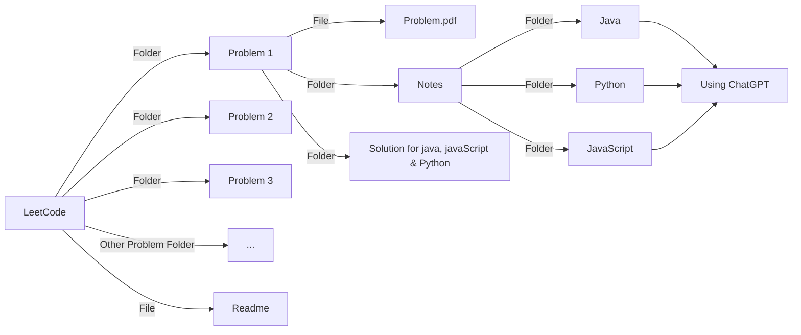

# LeetCode
🧠 This repository contains my journey of solving LeetCode problems. Each folder includes the problem statement, my solution, and a clear explanation. Follow along as I practice, learn, and improve my coding and problem-solving skills! 🚀

 
# 📊 LeetCode Stats
 

 
# 📚 Notes
| Topic | Java | JavaScript | Python |Remember Sequence|
| ---: | :--: | :--: | :--: | :--: |
| `List` | [Click Here](https://github.com/RouthKiranBabu/LeetCode/tree/main/1.%20Two%20Sum/Notes/List%20Methods/Java) | [Click Here](https://github.com/RouthKiranBabu/LeetCode/tree/main/1.%20Two%20Sum/Notes/List%20Methods/JavaScript) | [Click Here](https://github.com/RouthKiranBabu/LeetCode/tree/main/1.%20Two%20Sum/Notes/List%20Methods/Python) | [Click Here](https://github.com/RouthKiranBabu/LeetCode/blob/main/1.%20Two%20Sum/Notes/List%20Methods/Remember%20List%20Sequence.pdf) |

📂 Folder Structure

 

# Javascript
JavaScript is a high-level, interpreted programming language primarily used to create interactive and dynamic content on the web. It's one of the core technologies of the web, alongside HTML and CSS. Initially, it was designed to run in the browser, but with environments like Node.js, it's also widely used on the server side.
## Key Features of JavaScript:
1. **Lightweight & Interpreted:** JavaScript doesn’t need a compiler; it runs directly in the browser or in runtime environments like Node.js.
2. **Dynamically Typed:** Variable types are determined at runtime, making it flexible and easy to work with different data types.
3. **Event-Driven & Asynchronous:** JavaScript supports event-driven programming and asynchronous operations using callbacks, promises, and async/await.
4. **Prototype-Based Object Orientation:** Instead of classical inheritance, JavaScript uses prototypes for inheritance, offering powerful and flexible object-oriented capabilities.
5. **First-Class Functions:** Functions are treated as first-class objects, meaning they can be assigned to variables, passed as arguments, and returned from other functions.
6. **Platform Independent:** JavaScript runs in any environment that has a compatible interpreter — most commonly web browsers.
7. **Rich APIs for Web Development:** JavaScript provides APIs for tasks like DOM manipulation, AJAX requests, and working with storage, canvas, geolocation, and more.
8. **Support for Functional and Object-Oriented Programming:** Developers can use both paradigms based on their needs, making JavaScript highly versatile.
9. **Massive Ecosystem & Community:** With libraries like React, Angular, and frameworks like Node.js, JavaScript has one of the largest ecosystems in the development world.
