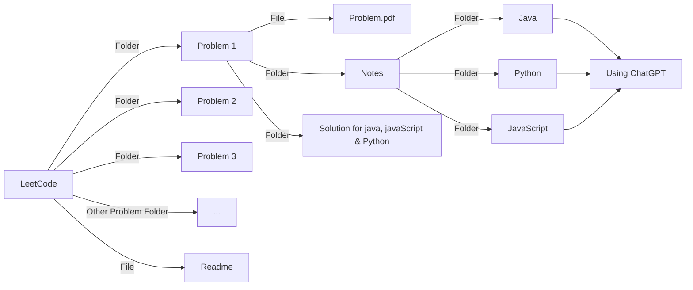

# LeetCode
🧠 This repository contains my journey of solving LeetCode problems. Each folder includes the problem statement, my solution, and a clear explanation. Follow along as I practice, learn, and improve my coding and problem-solving skills! 🚀

 
# 📊 LeetCode Stats
 

 
# 📚 Notes
| Topic | Java | JavaScript | Python |Remember Sequence|
| ---: | :--: | :--: | :--: | :--: |
| `List` | [Click Here](https://github.com/RouthKiranBabu/LeetCode/tree/main/1.%20Two%20Sum/Notes/List%20Methods/Java) | [Click Here](https://github.com/RouthKiranBabu/LeetCode/tree/main/1.%20Two%20Sum/Notes/List%20Methods/JavaScript) | [Click Here](https://github.com/RouthKiranBabu/LeetCode/tree/main/1.%20Two%20Sum/Notes/List%20Methods/Python) | [Click Here](https://github.com/RouthKiranBabu/LeetCode/blob/main/1.%20Two%20Sum/Notes/List%20Methods/Remember%20List%20Sequence.pdf) |

📂 Folder Structure

 

# Javascript
JavaScript is a high-level, interpreted programming language primarily used to create interactive and dynamic content on the web. It's one of the core technologies of the web, alongside HTML and CSS. Initially, it was designed to run in the browser, but with environments like Node.js, it's also widely used on the server side.
## Key Features of JavaScript:
1. **Lightweight & Interpreted:** JavaScript doesn’t need a compiler; it runs directly in the browser or in runtime environments like Node.js.
2. **Dynamically Typed:** Variable types are determined at runtime, making it flexible and easy to work with different data types.
3. **Event-Driven & Asynchronous:** JavaScript supports event-driven programming and asynchronous operations using callbacks, promises, and async/await.
4. **Prototype-Based Object Orientation:** Instead of classical inheritance, JavaScript uses prototypes for inheritance, offering powerful and flexible object-oriented capabilities.
5. **First-Class Functions:** Functions are treated as first-class objects, meaning they can be assigned to variables, passed as arguments, and returned from other functions.
6. **Platform Independent:** JavaScript runs in any environment that has a compatible interpreter — most commonly web browsers.
7. **Rich APIs for Web Development:** JavaScript provides APIs for tasks like DOM manipulation, AJAX requests, and working with storage, canvas, geolocation, and more.
8. **Support for Functional and Object-Oriented Programming:** Developers can use both paradigms based on their needs, making JavaScript highly versatile.
9. **Massive Ecosystem & Community:** With libraries like React, Angular, and frameworks like Node.js, JavaScript has one of the largest ecosystems in the development world.
# Java
Java is a high-level, class-based, object-oriented programming language that is designed to have as few implementation dependencies as possible. It was developed by Sun Microsystems (now owned by Oracle) and released in 1995. Java follows the “Write Once, Run Anywhere” (WORA) principle, which means compiled Java code can run on any platform that supports Java without the need for recompilation.
## Key Features of Java:
1. **Platform Independent:** Java code is compiled into bytecode which runs on the Java Virtual Machine (JVM), making it platform-independent.
2. **Object-Oriented:** Everything in Java is treated as an object, which makes code more modular, flexible, and extensible.
3. **Simple and Easy to Learn:** Java has a clean syntax similar to C++, but without complex features like operator overloading and multiple inheritance (with classes).
4. **Secure:** Java provides a secure execution environment through features like bytecode verification, a security manager, and the lack of explicit pointer manipulation.
5. **Robust:** Java emphasizes error-checking at compile-time and runtime, garbage collection, exception handling, and strong memory management.
6. **Multithreaded:** Java has built-in support for multithreading, allowing concurrent execution of two or more threads for maximum CPU utilization.
7. **Distributed:** Java is designed for building distributed applications with support for technologies like RMI (Remote Method Invocation) and EJB (Enterprise JavaBeans).
8. **High Performance:** Though not as fast as C or C++, Java’s performance is impressive due to the Just-In-Time (JIT) compiler in the JVM.
9. **Dynamic and Extensible:** Java programs can dynamically load classes, which means classes are loaded as and when needed.
10. **Rich API and Large Ecosystem:** Java provides a vast standard library and has strong community support with frameworks like Spring, Hibernate, and tools like Maven and Jenkins.
